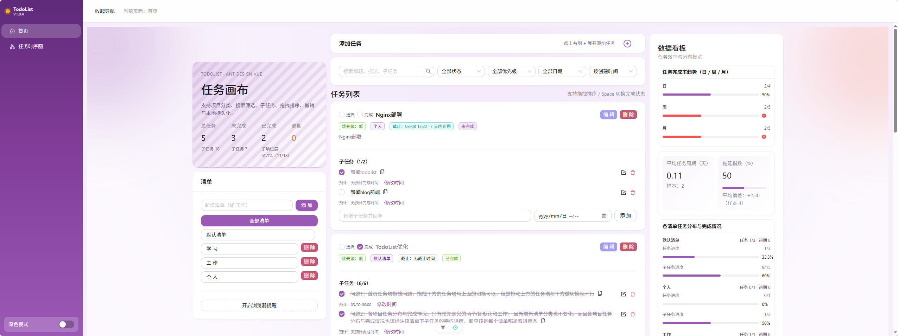
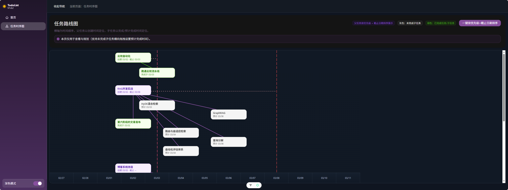

# TodoList (Vue + Ant Design Vue)

一个组件化的 TodoList Web 应用，基于 Vue 3 + Vite + TypeScript + Ant Design Vue。  
A componentized TodoList web app built with Vue 3 + Vite + TypeScript + Ant Design Vue.





## 版本说明 Version Notes

### V1.0.4 (2026-03-03)

- 新增任务添加区折叠交互优化：折叠时在“添加任务”右侧显示提示文案，展开后文案自动隐藏，图标在 `+ / -` 间切换。  
  Improved task composer collapse behavior: hint text shows beside “Add Task” when collapsed, hides on expand, and icon toggles between `+ / -`.
- 时序图底部时间轴默认长度改为按可视宽度自适应填充，默认尽量铺满且避免出现横向滚动条。  
  Timeline footer axis now auto-fits viewport width by default, maximizing fill while avoiding horizontal scrollbar in default state.
- 深色模式样式补强，并将时序图父任务/子任务节点颜色在深浅模式下统一为浅色方案，保证状态识别一致性。  
  Enhanced dark-mode styling and unified timeline parent/subtask node colors across light/dark themes using the light palette for consistent status recognition.

### V1.0.3 (2026-03-02)

- 任务时序图支持右键跳转：首页可按任务或子任务定位并自动滚动高亮。  
  Timeline now supports right-click navigation to Home, with auto-scroll and highlight targeting by task or subtask.
- 修复任务拖拽交互：拖拽触发区限制在 `task-drag-zone`，上下方向交换行为一致。  
  Fixed task drag interaction: drag trigger area is limited to `task-drag-zone`, with consistent up/down swap behavior.
- 子任务操作升级：新增图标化编辑/删除按钮；支持仅编辑子任务文本。  
  Upgraded subtask actions with icon-based edit/delete buttons and text-only editing support.
- 子任务文本复制体验优化：复制图标内联跟随文本末尾显示，并调整图标方向。  
  Improved subtask copy UX: inline copy icon follows text end and icon direction is adjusted.
- 首页数据看板增强：清单分布支持动态新增清单展示，并为每个清单提供任务进度 + 子任务进度双进度条。  
  Enhanced Home insights: dynamically includes newly added lists and provides dual progress bars (task + subtask) per list.
- 时序图子任务文本展示优化：超过 10 个字符自动截断并使用省略号显示。  
  Improved timeline subtask text rendering: texts longer than 10 characters are truncated with ellipsis.

### V1.0.2 (2026-03-02)

- 新增首页数据看板：任务完成率趋势（日/周/月）、平均任务周期、项目分布与完成情况、拖延指数。  
  Added Home insights dashboard: completion trend (day/week/month), average task cycle, project distribution/completion, and delay index.
- 增加深色模式切换，并修复深色样式在父级容器与时间线区域的覆盖问题（含 `todo-page`、`ant-card-body`、`timeline-body`）。  
  Added dark mode toggle and fixed dark-theme style cascading issues across parent containers and timeline areas (including `todo-page`, `ant-card-body`, and `timeline-body`).
- 任务列表支持键盘导航：`Tab / Shift+Tab / ↑ / ↓` 在任务项间快速切换焦点。  
  Added keyboard navigation in task list: `Tab / Shift+Tab / ↑ / ↓` to move focus between task items.
- 子任务预计完成时间编辑交互优化：改为“修改时间”按需展开编辑，点击空白自动取消未保存修改。  
  Improved subtask planned-time editing UX: on-demand “Modify Time” editor with auto-cancel on outside click.
- 按钮视觉优化：编辑按钮增强主题统一性，删除按钮保留警示特征并降低饱和度。  
  Refined button visuals: edit button aligned with theme style; delete button keeps warning semantics with softened saturation.

### V1.0.1 (2026-03-02)

- 新增左侧导航栏与页面路由：首页（任务工作台）+ 任务时序图页面。  
  Added left sidebar navigation and routing: Home (workspace) + Timeline page.
- 时序图升级为路线图视角：时间横轴、父子任务连线、截止线、当前时间定位（默认位于可视区域约 1/3 处）。  
  Upgraded timeline to roadmap view with horizontal time axis, parent-child links, due lines, and “now” positioning (around one-third of viewport by default).
- 时序图支持未完成子任务横向拖拽设置预计完成时间，并优化为更丝滑的拖拽预览。  
  Timeline now supports horizontal dragging for unfinished subtasks to set planned completion time, with smoother drag preview behavior.
- 首页子任务支持创建时设置预计完成时间，并可对已存在子任务进行“修改时间/保存”编辑。  
  Home page supports planned completion time on subtask creation and allows editing existing subtask planned time via “Modify Time / Save”.
- 主任务完成逻辑修复：支持确认弹窗后整任务（含子任务）联动完成/恢复。  
  Fixed parent completion flow: after confirmation modal, parent and all subtasks now complete/revert together.
- 视觉与交互优化：导航固定、时间线虚线分层、主题与样式统一为 `#9b59b6` 体系。  
  Visual and interaction enhancements: fixed sidebar, layered dashed timeline styling, and unified `#9b59b6` theme system.

### v1.0.0 (2026-03-02)

- 首个稳定版本发布，完成 TodoList 核心功能与组件化重构。  
  First stable release with core TodoList features and componentized architecture.
- 基于 Ant Design Vue 的 UI 与 `#9b59b6` 主题落地。  
  Implemented Ant Design Vue UI with `#9b59b6` themed styling.
- 支持主任务与子任务联动完成状态、拖拽排序、筛选搜索、本地持久化与撤销操作。  
  Supports parent/subtask completion sync, drag sort, filtering, search, local persistence, and undo.
- 修复“完成确认弹窗后状态未更新”的克隆异常问题。  
  Fixed clone-exception issue where completion confirmation did not update task state.

## 功能 Features

- 任务管理：新增 / 编辑 / 删除 / 完成状态切换  
  Task management: create / edit / delete / toggle complete state
- 子任务管理：新增 / 删除 / 勾选完成  
  Subtasks: create / delete / mark complete
- 主任务一键完成：点击主任务复选框时，会同步设置所有子任务为完成；取消时会同步取消子任务  
  One-click completion on parent task: toggling parent checkbox also updates all subtasks accordingly
- 项目清单（Projects）分类  
  Project-based task grouping
- 搜索、筛选、排序（状态 / 优先级 / 截止日期 / 手动拖拽）  
  Search, filter, and sort (status / priority / due date / manual drag)
- 本地持久化（localStorage）  
  Local persistence via localStorage
- 撤销操作（Undo Snackbar）  
  Undo support via Snackbar
- 截止日期提醒（浏览器通知）  
  Due-date reminder via browser notifications

## 技术栈 Tech Stack

- Vue 3
- Vite
- TypeScript
- Ant Design Vue
- Vitest
- Playwright

## 目录结构 Project Structure

```text
src/
  pages/
    HomePage.vue
    TodoTimelinePage.vue
  router/
    index.ts
  components/todo/
    TodoWorkspace.vue
    TodoHeader.vue
    ProjectSidebar.vue
    TaskComposer.vue
    TaskToolbar.vue
    TaskBulkActions.vue
    TaskList.vue
    UndoBar.vue
  composables/
    useTodoList.ts
  types/
    todo.ts
  App.vue
```

## 安装与运行 Setup

```bash
npm install
npm run dev
```

## 构建 Build

```bash
npm run build
```

## 测试 Test

```bash
npm run test:unit
npm run test:e2e
```

## 说明 Notes

- 主题色（Primary Color）为 `#9b59b6`。
- 如果浏览器不支持或未授权通知，提醒功能不会触发。
- 拖拽排序会自动切换到“手动排序”。
